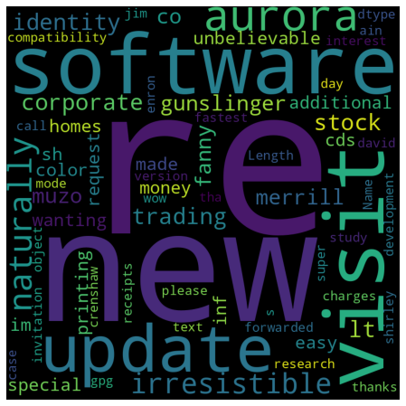
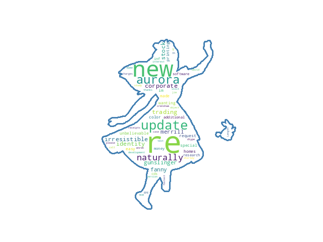

## word_cloud
A small word cloud generator written in Python. It is easy to visualize text data and understand word frequencies.

## Install dependent libraries
`pip install pandas`  
`pip install matplotlib`  
`pip install wordcloud`

## Screenshot
- The below is the screenshots

